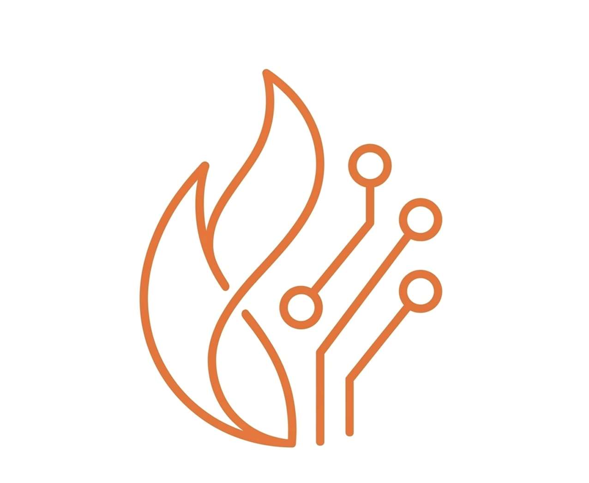

---
hide:
  - navigation
  - toc
---

# Welcome to RL-Kernel

<figure markdown="span">
  { align="center" alt="RL-Kernel" width="38%" }
</figure>

<strong>High-performance kernels and runtime infrastructure for RL post-training.</strong>

<a class="github-button" href="https://github.com/Flink-ddd/RL-Kernel" data-show-count="true" data-size="large" aria-label="Star">Star</a>
<a class="github-button" href="https://github.com/Flink-ddd/RL-Kernel/subscription" data-show-count="true" data-icon="octicon-eye" data-size="large" aria-label="Watch">Watch</a>
<a class="github-button" href="https://github.com/Flink-ddd/RL-Kernel/fork" data-show-count="true" data-icon="octicon-repo-forked" data-size="large" aria-label="Fork">Fork</a>

RL-Kernel bridges high-level alignment algorithms and low-level hardware optimizations.
It targets GRPO, PPO, DPO, and other reinforcement learning post-training workloads where
log probability computation, sampling, and memory pressure dominate the critical path.

Where to get started depends on the type of user:

- Run RL-Kernel locally with the [Quickstart Guide](./getting_started/quickstart.md).
- Understand supported kernels from the [Operators](./operators/README.md) section.
- Add a new operator by following the [Developer Guide](./contributing/README.md).
- Read dispatch details in the [Runtime Dispatch design document](./design/runtime-dispatch.md).

RL-Kernel focuses on:

- Hardware-aware dispatch for CUDA, ROCm, and PyTorch fallback paths.
- Fused GPU operators for post-training bottlenecks.
- Operator documentation as part of the merge contract.
- A documentation structure that can grow with the project as more operators,
  runtime features, benchmarks, and APIs are added.
